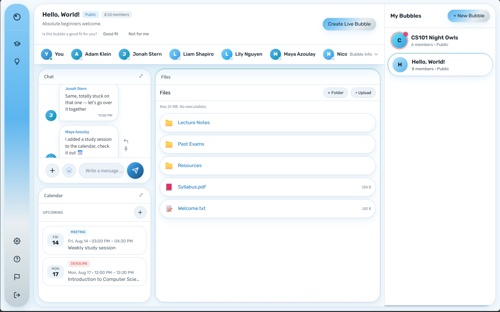

# Bubble.up

> A full-stack platform that matches university students into complementary study groups and gives each group a complete collaborative workspace.

[**Try the live demo**](https://demo.bubbleup.online) · No account required · English and Hebrew



Bubble.up tackles two connected problems: finding study partners who work well together, and giving a newly formed group everything it needs to begin studying immediately. Instead of browsing arbitrary groups, students receive recommendations from a confidence-aware matching engine. Every matched **Bubble** includes chat, shared files, a calendar, live video, a collaborative whiteboard, and access to verified experts.

## At a glance

- **Complementary matching:** recommends groups based on the roles they are missing, not simply on member similarity.
- **Real-time collaboration:** STOMP/WebSocket chat, presence-aware rooms, live sessions, and shared group activity.
- **Complete group workspace:** files, folders, events, deadlines, polls, members, video, and whiteboard tools in one interface.
- **Academic domain model:** universities, departments, courses, terms, offerings, enrollments, and course-gated group membership.
- **Expert workflow:** application, admin verification, session scheduling, capacity management, and Bubble enrollment.
- **Accessible internationally:** a bilingual English/Hebrew interface with full LTR and RTL layout support.

## Engineering highlights

### Deterministic, confidence-aware matching

Each student and Bubble is represented across seven collaboration roles:

> **Leader · Planner · Expert · Creative · Communicator · Team Player · Challenger**

A student's profile blends two sources of evidence:

1. **Character quiz answers**, normalized into a role-profile shape.
2. **Observed product behavior**, mapped through configurable signals with diminishing returns so one repeated action cannot dominate the profile.

The scorer calculates what a group is missing and measures how well a student fills those gaps using cosine similarity. Profile confidence determines how much the final recommendation relies on personalized fit versus group activity and popularity. The scorer is pure, stateless, deterministic, and unit-tested, so live recommendations and cached results use identical logic.

### Feature-oriented backend boundaries

The Spring Boot backend is organized into self-contained feature modules such as `auth`, `groups`, `chat`, `matching`, `expert`, and `catalog`. Each follows the same internal structure:

```text
model → persistence → application → api
```

Cross-feature access goes through explicit `internal/` interfaces rather than another feature's repositories. Shared infrastructure centralizes error handling, response envelopes, authentication context, time, file storage, pagination, configuration, and WebSocket publishing.

### Deliberate frontend state and transport ownership

The React client keeps state local by default and uses focused Zustand stores only for state that crosses pages or survives remounts. A single Axios client owns HTTP behavior, while one STOMP client owns the WebSocket lifecycle and room subscriptions. Strict TypeScript, centralized internationalization, and logical CSS properties keep the UI consistent across English, Hebrew, LTR, and RTL.

### Production-style delivery

- Docker Compose environments for local development, production, and the public demo.
- GitHub Actions for backend tests, frontend builds, container images, and deployment.
- Caddy-managed HTTPS and reverse proxying on the public VPS demo.
- Health checks, structured request logging, trace IDs, and container log inspection.
- Unit, integration, and end-to-end journey tests across core workflows.

## Product capabilities

| Area | What is implemented |
|---|---|
| **Matching** | Quiz and behavioral profiles, role vectors, confidence scoring, complementary recommendations, and trending fallback |
| **Bubbles** | Course-scoped groups, enrollment-gated membership, roles, invitations, and automatic workspace provisioning |
| **Chat** | Real-time STOMP messaging, system messages, polls, linked events, presence, and reconnect handling |
| **Files** | Group folders, upload/download, file metadata, access control, and pluggable storage |
| **Calendar** | Study events, meetings, deadlines, exams, and expert sessions |
| **Live sessions** | Video rooms, collaborative whiteboard, and host-gated controls |
| **Experts** | Applications, admin review, verification, session creation, capacity, and group enrollment |
| **Platform** | JWT authentication, academic catalog, admin tools, demo isolation, i18n, and RTL support |

## Architecture and stack

```text
React + TypeScript
        │
        ├── REST / Axios
        └── STOMP / WebSocket
                │
Java 21 + Spring Boot 3
        │
        ├── PostgreSQL / JPA
        ├── File storage abstraction
        └── Video and whiteboard integrations
```

| Layer | Technologies |
|---|---|
| **Frontend** | React 18, TypeScript, Vite, Tailwind CSS, Zustand, i18next, Axios, STOMP.js |
| **Backend** | Java 21, Spring Boot 3, Spring Security, JPA/Hibernate, WebSocket/STOMP, JWT |
| **Data** | PostgreSQL in deployed environments, H2 for tests |
| **Delivery** | Docker, Docker Compose, GitHub Actions, GHCR, Caddy, VPS |
| **Testing** | JUnit 5, Spring integration tests, MockMvc journey tests, frontend build/type checks |

## How a Bubble works

A Bubble is a small study group anchored to one course offering. Membership is validated against course enrollment, and creating a Bubble automatically provisions its default chat room. Members then share one workspace for conversation, materials, scheduling, and live study sessions—without assembling separate chat, storage, calendar, and meeting tools.

The academic hierarchy keeps recommendations and collaboration properly scoped:

```text
University → Department → Course → Offering → Bubble
```

## Run locally

### Full stack with Docker

```bash
docker compose up --build
```

This starts PostgreSQL, the Spring Boot backend on `:8080`, and the React frontend on `:3000`.

### Run each side independently

```bash
# Backend — requires PostgreSQL on :5432
cd backend
mvn spring-boot:run

# Frontend — proxies /api to :8080
cd frontend
npm install
npm run dev
```

Environment templates are provided in [`.env.example`](.env.example) and [`.env.prod.example`](.env.prod.example). Never commit real credentials.

### Verify the build

```bash
cd backend && mvn test
cd frontend && npm run build
```

## Repository layout

```text
backend/              Spring Boot application and tests
frontend/             React application
infra/                Infrastructure and deployment configuration
.github/workflows/    CI and deployment pipelines
docs/images/          README media
```

---

Bubble.up is an evolving engineering project. The public demo runs in an isolated sandbox with generated data that is reset periodically.
